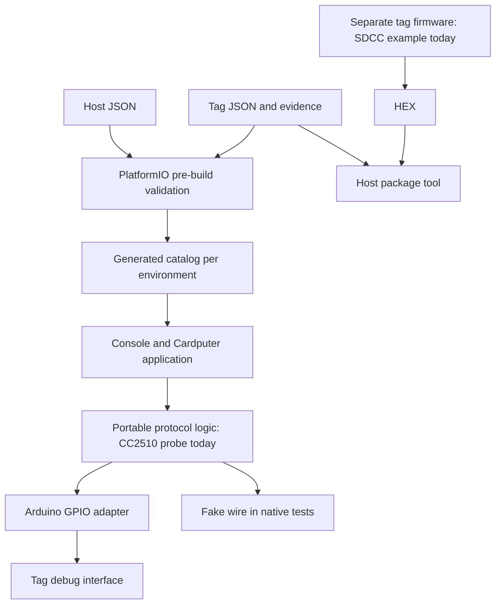

# Architecture

The project is an e-tag workbench with the Cardputer Advance as its preferred portable host. Host hardware, tag records, protocol implementations, and tag applications are separate so support can grow across manufacturers and MCU families.

There are two independent firmware products. The root PlatformIO project builds the Cardputer/ESP32 application using Arduino C++; target projects build firmware using the compiler and memory model appropriate to each tag MCU. A `.bin` from the ESP32 project is never a tag firmware image. Computer-side tools handle validation, packaging, and backup archival.

`tools/etaglib.py` validates profiles and host pins without third-party Python dependencies. `tools/pio_prepare.py` runs it before every embedded build, checks the PlatformIO board against the host profile, and creates `.pio/build/<environment>/generated/etag_catalog.h`. Hardware revision profiles remain compiled in. The browser connection parses bounded JSON commands on-device; it does not import programming profiles.

The current dispatcher constructs one `CcDebugProbe`, and the host pin schema describes TI DD/DC/RESET. The structure allows additional protocols, but runtime protocol registration, SWD/UART/SPI adapters, and their pin schemas are not implemented. New protocol metadata alone cannot create support. Extend dispatch, transport interfaces, host configuration and capability reporting together when adding a backend.

`EtagCore` owns protocol decisions, not GPIO calls. `CcDebugProbe` sends only GET_CHIP_ID and READ_STATUS. It reads identity twice, rejects missing/inconsistent/wrong-chip responses, and releases the target for every active probe outcome. Unsupported profiles return before entering debug mode. GPIO entry and each byte transfer are finite operations; there is no unbounded wait for a missing target.

The Arduino adapter owns data direction and reset. RESET is open-drain and relies on the target pull-up; DD is a bidirectional push-pull debug signal, not I2C. The operator supplies and verifies target power. The idle state disables all three drivers and pull resistors. The single main-loop command dispatcher owns the wire; the wired console does not run alongside IR transmission. The display mode owns a bounded RMT transmit task and enables the browser connection only when explicitly opened. It has no Wi-Fi server.

In wired diagnostics mode, Cardputer commands and serial commands use the same dispatcher. Serial and keyboard input have separate buffers; overlong lines are discarded. The screen wraps recent output, while serial carries full text. SD is mounted only on request and never auto-formatted. Probe records are created with unused filenames and remain distinct from binary backups.

Tag profiles describe shared hardware revisions; inventory records describe individual units. The initial research catalog contains one CC2510 hypothesis and one unknown model, and is intended to grow with the user's collection. Profile confidence, implemented operations, and successful bench validation are separate facts. Runtime probing can investigate a candidate only after the operator invokes `probe confirmed`. Neither a successful probe nor a package hash upgrades a profile to verified.

Package creation requires a verified profile and embeds a snapshot of it. The current format represents main flash starting at zero, filled to the recorded capacity with `0xFF` padding. Other memory layouts need explicit format/validation extensions. Verification also checks local evidence paths, so packages are currently workspace artifacts, not standalone exchange bundles or cryptographically signed firmware. The Cardputer does not yet consume these packages.

The `backups/` area holds per-unit acquisitions; `artifacts/` holds reproducible derived output. Both are ignored by Git. Archive originals and evidence under `hardware/` and `docs/reference/`, where checks protect the original-file hashes.

## Display editing

TagTinker-derived protocol/frame/codec/waveform code lives under `lib/EtagCore/src/etag/display/` and remains independent of Arduino. The Cardputer adapters and menu live under `firmware/programmer/src/display/`; other ESP32 builds exclude those adapters. The existing TI core and tag-firmware projects remain independent.

`main.cpp` initializes M5Cardputer once and checks `board_M5CardputerADV` before initializing IR, SD, or either active workflow. The display menu is the default. Its wired-console handoff is available only from the idle main menu. In console mode, `display` switches ownership back. No browser command maps to wired probing, erase, or programming.

IR device records in NVS namespace `etag-ir` are per-unit address/display settings, distinct from the revision evidence catalog in `profiles/tags/`. They use a versioned blob containing names and settings together. Failed writes roll back the in-memory edit and return an error. Validated dimensions, address/barcode consistency, and operation capabilities are shared by persistence and the browser adapter. Neither barcode recognition nor successful emission upgrades hardware confidence. The wired profile selection is remembered separately in `etag-console`.

The transmitter uses GPIO44 from generated host metadata, a 1.25 MHz carrier and ESP32-S3 RMT TX channel 0 with four memory blocks. It owns the full frame waveform, repeats/wake timing, progress and cancellation. An image buffer remains owned by its caller until the asynchronous task finishes. Success means emitted, never acknowledged. No other IR library or peripheral may claim these RMT blocks.

USB and BLE browser sessions are mutually exclusive. USB does not initialize BLE. The BLE server is allocated lazily once and reused across sessions; exiting stops advertising and disconnects clients, while controller memory remains allocated until reboot. Reboot and choose USB for maximum available image memory. BLE callbacks only copy into a fixed queue; parsing, saved-device writes and upload handling run on the main loop. Line and upload sizes are bounded, offsets and encoded payloads are checked, and queue overflow ends the connection session. USB work per loop is bounded. Allocation guards reject oversized uploads before reserving their buffers.

The two modes share one SD adapter (`sd_card.cpp`) and generated pin settings, with a conservative 4 MHz bus. Image files live in `/etag/images`; probe logs retain `/etag/probe-NNNNNN.json`. No mount operation formats a card. Text is rendered in strips to reduce RAM use. SD image rendering uses a compact 1/2-bit canvas and can reject large images if memory is unavailable; browser preparation is preferable for large panels.

The browser source in `web/` is served directly; there is no duplicate GitHub Pages build. USB uses Web Serial, BLE uses Nordic UART Service with 20-byte writes, and both use newline-delimited JSON. Browser upload/save acknowledgements confirm Cardputer receipt/persistence only. They are not tag acknowledgements.
