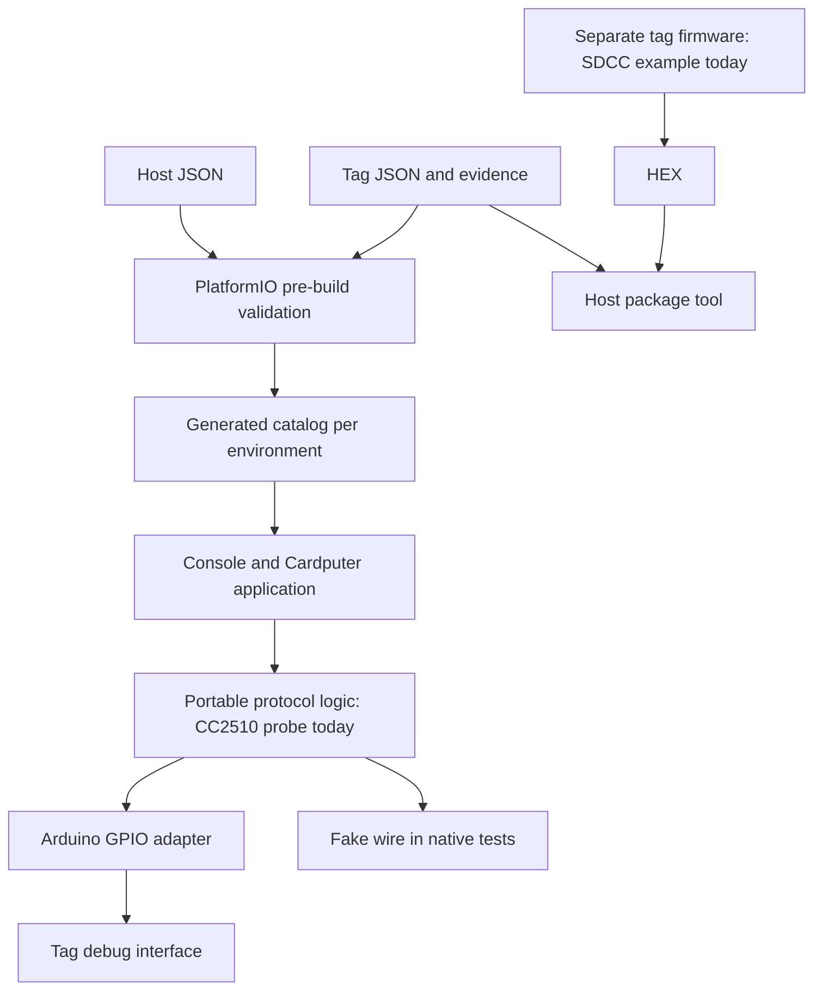

# Architecture

The project is an e-tag workbench with the Cardputer Advance as its preferred portable host. Host hardware, tag records, protocol implementations, and tag applications are separate so support can grow across manufacturers and MCU families.

There are two independent firmware products. The root PlatformIO project builds the Cardputer/ESP32 application using Arduino C++; target projects build firmware using the compiler and memory model appropriate to each tag MCU. A `.bin` from the ESP32 project is never a tag firmware image. Computer-side tools handle validation, packaging, and backup archival.

`tools/etaglib.py` validates profiles and host pins without third-party Python dependencies. `tools/pio_prepare.py` runs it before every embedded build, checks the PlatformIO board against the host profile, and creates `.pio/build/<environment>/generated/etag_catalog.h`. The application never parses JSON on-device in this milestone.

The current dispatcher constructs one `CcDebugProbe`, and the host pin schema describes TI DD/DC/RESET. The structure allows additional protocols, but runtime protocol registration, SWD/UART/SPI adapters, and their pin schemas are not implemented. New protocol metadata alone cannot create support. Extend dispatch, transport interfaces, host configuration and capability reporting together when adding a backend.

`EtagCore` owns protocol decisions, not GPIO calls. `CcDebugProbe` sends only GET_CHIP_ID and READ_STATUS. It reads identity twice, rejects missing/inconsistent/wrong-chip responses, and releases the target for every active probe outcome. Unsupported profiles return before entering debug mode. GPIO entry and each byte transfer are finite operations; there is no unbounded wait for a missing target.

The Arduino adapter owns data direction and reset. RESET is open-drain and relies on the target pull-up; DD is a bidirectional push-pull debug signal, not I2C. The operator supplies and verifies target power. The idle state disables all three drivers and pull resistors. The single main-loop command dispatcher owns the wire; the app has no Wi-Fi server, radio task, or background target operation.

Cardputer commands and serial commands use the same dispatcher. Serial and keyboard input have separate buffers; overlong lines are discarded. The screen wraps recent output, while serial carries full text. SD is mounted only on request and never auto-formatted. Probe records are created with unused filenames and remain distinct from binary backups.

Tag profiles describe shared hardware revisions; inventory records describe individual units. The initial research catalog contains one CC2510 hypothesis and one unknown model, and is intended to grow with the user's collection. Profile confidence, implemented operations, and successful bench validation are separate facts. Runtime probing can investigate a candidate only after the operator invokes `probe confirmed`. Neither a successful probe nor a package hash upgrades a profile to verified.

Package creation requires a verified profile and embeds a snapshot of it. The current format represents main flash starting at zero, filled to the recorded capacity with `0xFF` padding. Other memory layouts need explicit format/validation extensions. Verification also checks local evidence paths, so packages are currently workspace artifacts, not standalone exchange bundles or cryptographically signed firmware. The Cardputer does not yet consume these packages.

The `backups/` area holds per-unit acquisitions; `artifacts/` holds reproducible derived output. Both are ignored by Git. Archive originals and evidence under `hardware/` and `docs/reference/`, where checks protect the original-file hashes.
